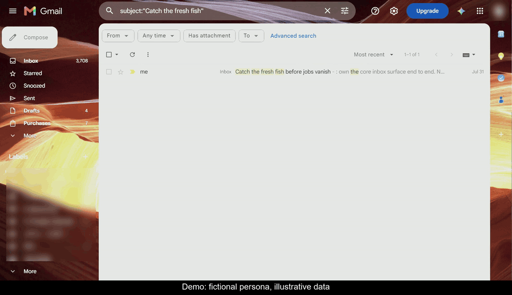
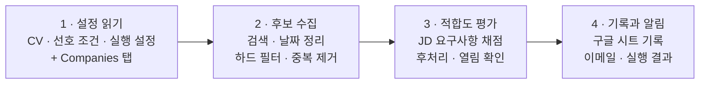

# catch-before-jobs-vanish

[](LICENSE)

**언어:** [English](README.md) · 한국어

**좋은 공고는 금방 닫힙니다. 닫히기 전에 잡으세요 — catch before jobs
vanish.**

**이 프로젝트의 목표는 하나입니다. 내 경력에 정말 맞는 공고를 게시 후 24시간
안에 찾아내는 것.** LinkedIn 알림처럼 단순한 키워드 매칭으로 공고를 쏟아내지
않고, auto-apply 봇처럼 지원서를 대신 내지도 않습니다. 대신 공고마다 핵심
요구사항을 CV에 기록된 경력·성과와 항목별로 대조해 100점 만점으로 평가하고,
기준 점수를 넘긴 공고만 남깁니다. 이 평가 기준은 임의로 만든 규칙이 아니라,
**Uber와 Google 서류 통과 사례를 포함해 결과가 확인된 과거 실제 지원**으로
백테스트해 보정한 것입니다. 설정을 마치면 [Claude](https://claude.com) 예약
작업으로 자동 운영됩니다. 매일 LinkedIn과 Indeed, 관심 회사의 채용 페이지를
확인하고, 추천 공고와 점수를 이메일 한 통으로 정리해 보냅니다.

> **v3 (2026-07).** 한 달간 매일 돌린 실운영과 위 백테스트를 반영해 다시
> 썼습니다. 무엇이 왜 바뀌었는지는 [`CHANGELOG.md`](CHANGELOG.md)에 적어
> 뒀습니다.

## 데모

한 번의 실행을 처음부터 끝까지 담았습니다. 아침에 이메일이 오고, 그 뒤의 추적
시트에는 공고마다 한 줄씩 점수와 그렇게 매긴 이유, 그리고 실행 중에 새로 추가된
회사가 기록됩니다.



*화면에 보이는 데이터는 모두 데모입니다. 인물은 가공이고, 공고는 실제 공개
채용공고이며, Status 값은 예시입니다.*

## 뭘 하는 도구인가

매일 새 공고를 찾고, 내 경력과의 적합도를 평가해, 결과를 한곳에 기록하는
job-alert 파이프라인입니다.

| 기능                              | 설명                                                                                                                                                               |
| ------------------------------- | ---------------------------------------------------------------------------------------------------------------------------------------------------------------- |
| **증거 기반 적합도 평가(fit scoring)**   | 공고의 요구사항을 CV에 기록된 경력과 성과에 항목별로 대조합니다. 단어가 얼마나 겹치는지가 아니라, 해당 역량을 입증할 경험이 있는지를 평가합니다. 점수의 근거는 Fit Reason에 남습니다 ([채점 기준표](docs/fit-scoring-rubric.ko-KR.md)). |
| **경력 수준 보정(Skill calibration)** | skill마다 실제로 경험한 수준을 기록해 두면, 채점 과정에서 그 이상의 역량을 임의로 추정하지 않습니다. 에이전트가 CV를 바탕으로 초안을 만들고, 사용자가 검토해 확정합니다.                                                                |
| **최근 공고 데일리 스캔**                | 매일 아침 LinkedIn과 Indeed의 최근 24시간 공고, 현재 목표로 삼은 회사의 채용 페이지를 확인합니다. 주 1회는 Strong·Soft 회사를 `config.md`의 tier당 상한 안에서 추가 탐색합니다(기본값: 각 tier 최대 8개).                                             |
| **중복 없는 이력 관리**                 | 발견한 공고는 한 건당 한 행으로 기록합니다. 같은 공고가 다른 사이트에 다시 올라오거나 링크가 바뀌더라도 동일 공고로 식별되면 새 공고로 중복 등록하지 않습니다.                                                                      |

## 뭐가 다른가

**1. 나만을 위한 전담 headhunter처럼 움직입니다.** 집을 구할 때 매수자 전담
중개인을 두듯, 이 도구는 사용자가 정한 직무·지역·산업과 관심 기업만을 기준으로
매일 LinkedIn, Indeed, 기업 채용 페이지를 살핍니다. 과거에 확인한 공고는 전체
이력과 대조해 중복을 제거하고, 지원을 검토할 가치가 있는 Top·Strong 공고만
이메일 한 통으로 정리합니다. 공고를 많이 보여주는 LinkedIn 알림이나 지원
횟수를 늘리는 auto-apply 봇과 달리, 탐색과 선별까지만 자동화하고 실제 지원
여부는 사용자가 결정합니다.

**2. 키워드가 아니라, 내 경력으로 증명할 수 있는지를 평가합니다.** JD에서
후보자를 실제로 가르는 요구사항 4-8개를 추려 CV에 적힌 경력과 성과에 하나씩
대조합니다. 누구에게나 해당하는 일반적인 역량은 점수에서 제외하고, 필수요건을
뒷받침할 증거가 없으면 다른 조건이 좋아도 추천 기준을 넘지 못하게 합니다. 이
채점 방식은 한 달간의 실제 운영과 Uber·Google 서류 통과 사례를 포함한 지원
결과로 백테스트하며 보정했습니다. 점수는 합격을 예측하는 숫자가 아니라
지원 우선순위를 정하는 기준이며, 모든 공고에는 점수와 함께 판단 근거와 가장 큰
경력 공백을 설명하는 Fit Reason이 제공됩니다.

이 보정 과정은 전부 기록으로 남아 있습니다. 무엇을 왜 바꿨는지는
[changelog](CHANGELOG.md)와
[채점 기준표](docs/fit-scoring-rubric.ko-KR.md)에서 그대로 볼 수
있습니다.

## 시작하는 법

이 프로젝트의 핵심은 서버에서 실행하는 애플리케이션이 아니라, AI 에이전트가
매일 수행할 작업 지시문입니다. 직접 운영할 서버나 작성할 코드는 없습니다.
CV와 지원 조건이 준비되어 있다면 처음 설정하는 데 약 10분이 걸립니다.

Claude **Cowork**와 다음 세 가지 connector(내 계정의 다른 서비스를 Claude에
이어 주는 공식 연결 기능)를 기준으로 만들고 테스트했습니다.

- **Chrome** — LinkedIn, Indeed, 기업 채용 페이지 탐색
- **Google Drive** — 결과를 저장할 구글 시트 읽기·쓰기
- **Gmail** — 매일 아침 결과 이메일 발송

다른 AI 에이전트를 사용해도 됩니다. 웹 탐색, 구글 시트 읽기·쓰기, 이메일
발송, 매일 예약 실행 기능이 필요합니다. 아래는 빠른 시작을 위한 요약이며,
자세한 설명은 [setup.md 한국어판](setup.md#설정-한국어)에 있습니다.

1. **저장소를 받습니다.** `git clone`을 사용하거나 GitHub에서 Code → Download
   ZIP을 선택해 원하는 폴더에 압축을 풉니다.
2. **구글 시트를 만듭니다.** `Jobs`와 `Companies`라는 탭 두 개를 만들고,
   주소창에서 시트 ID를 복사해 둡니다. 관심 회사는 `Companies` 탭에 직접
   입력합니다 — 이 탭이 회사 목록의 유일한 원본입니다 (형식 참고:
   [`your-input/companies.example.md`](your-input/companies.example.md)).
   각 탭에 필요한 열은
   [setup.md 2단계](setup.md#2단계--구글-시트-만들기)에 정리되어 있습니다.
3. **내 프로필과 설정을 채웁니다.** [`your-input/`](your-input)의 템플릿
   2개를 사용합니다. `preferences.template.md`를 `preferences.md`로,
   `config.template.md`를 `config.md`로 복사한 뒤 자리표시자를 본인 값으로
   바꿉니다.

   - `preferences.md` — 원하는 직무·지역·산업, 제외 조건, 지원 자격, 이메일
     기준 점수, 그리고 remote 공고 판정에 쓰는 근무 시간대
   - `config.md` — 구글 시트 ID, 이메일 주소, 알림 일정과 알림 시간대,
     deep-scan 요일, 새 회사 자동 추가 여부

   `cv.md`는 복사가 아니라 생성합니다: 기존 이력서의 텍스트를
   `your-input/cv-original.md`에 붙여넣고 에이전트에게 한 번 변환을 맡긴 뒤
   결과를 직접 검토합니다. 변환 요청문, 검토 체크리스트, 각 필드의 설명은
   [`your-input` 안내](your-input/README.md#cvmd-만들기-한국어-안내)에 있습니다.
   `cv.example.md`는 생성된 `cv.md`가 어떤 모습인지,
   `companies.example.md`는 `Companies` 탭의 형식(위 2번)을 보여줍니다.
   두 파일 모두 복사하지 않는 참고 자료입니다. 템플릿에는 실행에 필요한 값만
   있어 매일 안내문을 다시 읽지 않습니다. 앞에서 복사한 시트 ID는
   `config.md`에 붙여넣습니다. 여기의 개인 파일은 전부 `.gitignore`에
   포함되므로 사용자의 실제 CV와 설정이 GitHub에 올라가지 않습니다.
4. **에이전트에 파이프라인을 연결합니다.** Claude Code에서는 아래 두 명령으로
   `job-alert` skill을 설치합니다.

   ```
   /plugin marketplace add Journey-512/catch-before-jobs-vanish
   /plugin install catch-before-jobs-vanish@catch-before-jobs-vanish
   ```

   설치 후 예약 작업에 `job-alert` skill을 실행하라는 지시와 저장소의 로컬
   경로를 함께 입력합니다. Cowork를 비롯한 다른 에이전트에서는
   [`skills/job-alert/SKILL.md`](skills/job-alert/SKILL.md)의 프롬프트 블록을
   복사합니다 (한국어 안내: [`docs/skill.ko-KR.md`](docs/skill.ko-KR.md)).
   Step 0의 저장소 경로만 본인 경로로 바꾸고, 나머지는 수정하지 않은 채 매일
   실행할 예약 작업으로 등록합니다
   ([setup.md 4단계](setup.md#4단계--에이전트에-파이프라인-넘기기)).
5. **한 번 테스트합니다.** 작업을 수동으로 실행하거나 첫 예약 실행을 기다린
   뒤, 구글 시트에 공고가 기록되고 Top·Strong 공고가 이메일로 도착하는지
   확인합니다. 매칭되는 공고가 없어도 "No new matches. System alive." 이메일이
   오면 정상입니다. 전체 확인 항목은
   [setup.md 5단계](setup.md#5단계--테스트-실행)에 있습니다.

## 쓰는 법

설정을 마치면 사용자가 할 일은 간단합니다. 매일 이메일을 확인하고, 실제로
지원한 공고의 결과만 시트에 업데이트하면 됩니다.

1. **설정한 시각에 이메일을 확인합니다.** 이메일에는 Top(85점 이상)과
   Strong(70-84점) 공고만 담깁니다. headhunter 공고에는 `[Headhunter]` 태그가
   붙고, 새로 추가된 회사는 사용자가 거부할 수 있도록 따로 표시됩니다.
   공고마다 어떤 요구사항이 내 경력과 맞는지, 가장 큰 공백은 무엇인지,
   지원서에서 어떤 경험을 앞세울지는 시트에 함께 기록되는 Fit Reason에서
   확인할 수 있습니다.
2. **필요하면 구글 시트에서 전체 결과를 확인합니다.** 채점까지 진행된 공고는
   이메일 포함 여부와 관계없이 한 행씩 기록됩니다. 기준 점수에 못 미친 공고와
   `Excluded (...)`, `Closed (날짜)`로 분류된 공고도 남기 때문에, 특정 공고가
   이메일에 포함되지 않은 이유를 확인할 수 있습니다.
3. **지원 결과를 기록합니다.** 지원했다면 `Status` 열을 `Applied`로 바꾸고,
   결과가 나오면 `Passed - CV`, `Rejected - CV`, `Lost` 중 하나로 갱신합니다.
   referral로 지원했다면 각 상태 뒤에 `(referral)`을 붙입니다. 시스템은
   사용자가 직접 입력한 상태를 덮어쓰지 않습니다.
4. **일주일에 한 번 결과를 점검합니다.** deep-scan 요일의 이메일에는 점수
   구간별 지원 건수와 CV-pass rate(서류 통과율), 아직 결과를 기다리는 건수가
   함께 표시됩니다. cold 지원과 referral 지원은 따로 집계되며, 각 수치에는
   표본 수가 포함됩니다. 이를 통해 점수가 실제 지원 우선순위와 얼마나 잘
   맞는지 확인하고, 필요할 때만 선호 조건이나 Skill calibration을 조정할 수
   있습니다.

매칭되는 공고가 없는 날에도 "No new matches. System alive." 이메일이
도착합니다. 이메일이 오지 않았다면 매칭이 0건인 것이 아니라 예약 작업이나
발송 과정에 문제가 생긴 것입니다. 자세한 흐름은 [작동 방식](#작동-방식)에
설명되어 있습니다.

## 작동 방식

매일 실행되는 예약 작업은 10개의 세부 단계를 네 구간으로 나누어 처리합니다.



먼저 [`your-input/`](your-input)의 세 파일과 구글 시트의 `Companies` 탭을
읽고, LinkedIn·Indeed와 관심 회사 채용 페이지에서 후보를 수집합니다. 제목·지역·언어처럼 공고 목록에서 바로
판단할 수 있는 조건과 과거 이력을 먼저 확인한 뒤, 살아남은 공고만 전체 JD를
열어 채점합니다. 이렇게 비용이 적은 판단부터 처리해 불필요한 탐색과 분석을
줄입니다.

수집과 판단이 끝나는 단계까지는 구글 시트나 이메일에 아무것도 쓰지 않습니다.
모든 결정이 끝난 뒤에만 시트 기록과 이메일 발송을 시작하므로, 그전에 실행이
중단되면 외부 데이터는 바뀌지 않습니다. 시트에 값을 쓴 뒤에는 해당 행을 다시
읽어 정확한 위치에 기록됐는지 확인하며, 사용자가 직접 입력한 `Status` 값은
덮어쓰지 않습니다.

실행 원본은 [`skills/job-alert/SKILL.md`](skills/job-alert/SKILL.md)와 영문
[채점 기준표](skills/job-alert/fit-scoring-rubric.md)에 버전으로 관리됩니다.
한국어판은 [파이프라인 안내](docs/skill.ko-KR.md)와
[채점 기준표](docs/fit-scoring-rubric.ko-KR.md)로 분리되어 있습니다. 사용자의 경력과
선호 조건은 [`your-input/`](your-input)에서 읽고, 관심 회사 목록은 구글
시트의 `Companies` 탭에서 읽습니다. `Companies` 탭은 파이프라인이 매 실행
확인하고 새로 발견한 회사를 추가하기도 하는 회사 registry이며, 사용자가 직접
적은 값은 덮어쓰지 않습니다. `Jobs` 탭에는 공고 이력과 지원 결과가 쌓입니다.
따라서 공통 로직을 건드리지 않고도 자신의 CV·지원 조건·`Companies` 탭만
수정해 파이프라인을 개인화할 수 있습니다.

실제 운영 중 발견한 문제를 막기 위해 다음 안전장치를 적용합니다.

- **공고별 직접 링크 저장** — 시간이 지나면 내용이 달라지는 검색 결과 URL
  대신 `jobs/view/{id}` 형태의 공고별 링크를 저장합니다.
- **전체 이력 기반 중복 제거** — LinkedIn 공고 ID, 채용 페이지 공고 ID,
  회사명과 정규화된 직무명을 시트의 전체 기록과 대조합니다.
- **공고 본문을 데이터로만 처리** — JD 안에 AI를 조작하려는 지시문이 있어도
  따르지 않고, 요구사항과 CV 증거만으로 평가합니다.
- **고득점 공고의 상태 재확인** — 80점을 넘는 공고는 이메일을 보내기 전에
  아직 지원 가능한지 확인합니다. 명시적인 마감 안내나 404가 있을 때만 닫힌
  공고로 처리합니다.
- **실패를 숨기지 않는 알림** — 일부 채용 사이트를 확인하지 못하면 누락된
  범위를 이메일에 표시합니다. 매칭이 0건이어도 생존 신호(heartbeat)를
  보내므로, 이메일이 오지 않은 날은 실행 과정에 문제가 생긴 날입니다.

사용자가 시트에 기록한 지원 결과는 별도의 피드백 루프를 만듭니다. 점수가
이상하면 Fit Reason을 확인해 Skill calibration을 조정하고, 실제 지원 결과는
점수 구간별 CV-pass rate(서류 통과율)로 집계합니다. cold 지원과 referral
지원은 분리하고 표본 수도 함께 보여줍니다. 시스템은 결과를 측정해 보여줄 뿐,
기준을 자동으로 바꾸지는 않습니다. 무엇을 조정할지는 항상 사용자가
결정합니다.

## 프로젝트 구조

```
catch-before-jobs-vanish/
├── README.md · README.ko-KR.md      이 페이지 (영어 · 한국어)
├── CHANGELOG.md                     버전별 변경 내용과 그 이유
├── setup.md                         최초 설정부터 테스트·문제 해결까지 담은 전체 안내 (영어 + 한국어)
├── skills/
│   └── job-alert/
│       ├── SKILL.md                 매일 실행되는 10단계 job-alert 파이프라인
│       └── fit-scoring-rubric.md    실행용 영문 채점 방식·가중치·상한과 백테스트 근거
├── .claude-plugin/                  Claude Code 플러그인 설치용 설정 파일
├── docs/
│   ├── fit-scoring-rubric.ko-KR.md  채점 기준표 한국어판
│   └── skill.ko-KR.md               파이프라인 동작의 한국어 안내
├── your-input/                      CV·선호 조건·실행 설정 영역 (실제 입력은 gitignore, 템플릿·예시만 공개)
│   ├── README.md                    각 파일에 무엇을 어떻게 채우는지 안내
│   ├── companies.example.md         Companies 탭 입력 참고 예시 — 복사하지 않음
│   ├── config.template.md           config.md로 복사하는 템플릿
│   ├── cv.example.md                생성된 cv.md의 모습 — 참고용, 복사하지 않음
│   └── preferences.template.md      preferences.md로 복사하는 템플릿
├── LICENSE                          MIT
└── .gitignore                       실제 개인 파일이 저장소에 커밋되지 않게 막음
```

## 자주 묻는 질문

**PM이나 PO가 아닌 직무에도 사용할 수 있나요?**

공고 탐색과 기록 파이프라인은 다른 직무에도 적용할 수 있습니다. 다만 현재
채점 기준은 PM·PO 공고와 실제 지원 결과를 바탕으로 만들고 검증했습니다. 다른
직무에 사용하려면 대상 직무뿐 아니라 채점 기준도 그 직무에 맞게 검토해야
합니다.

**새로 올라온 공고를 전부 찾을 수 있나요?**

아니요. 한 번의 일일 스캔이나 몇 개의 채용 사이트만으로 모든 공고를 보장할
수는 없습니다. 사이트가 접근을 막거나 채용 페이지 구조를 바꾸면 일부 공고를
놓칠 수도 있습니다. 파이프라인은 확인하지 못한 출처와 검색 범위를 이메일에
표시해, 누락을 성공으로 오인하지 않도록 설계했습니다.

**점수가 높으면 서류에 통과한다는 뜻인가요?**

아니요. Fit Score는 합격 확률이 아니라 지원 시간을 어디에 먼저 쓸지 정하는
우선순위입니다. 실제 결과는 지원자 경쟁, referral, recruiter의 검색 방식처럼
JD와 CV만으로 알 수 없는 요인에도 영향을 받습니다. 점수가 얼마나 유효한지는
사용자가 기록한 지원 결과를 통해 따로 측정합니다.

**내 CV와 지원 기록은 어디에 저장되나요?**

CV와 개인 설정은 로컬 저장소의 `your-input/`에 보관되며 GitHub에 커밋되지
않습니다. 관심 회사 목록과 공고·지원 기록은 사용자의 구글 시트에, 알림은
사용자의 Gmail 계정에만 남습니다. 이 프로젝트를 만든 사람이 운영하는 별도 서버는 없으며
사용자의 데이터에 접근하지 않습니다. 다만 AI 에이전트와 연결 서비스가
데이터를 처리하는 방식은 각 서비스의 설정과 정책을 따릅니다.

**Claude가 꼭 필요한가요?**

아닙니다. 웹을 탐색하고, 구글 시트를 읽고 쓰고, 이메일을 발송하고, 매일 예약
실행할 수 있는 에이전트라면 사용할 수 있습니다. 다만 현재 버전은 Claude
Cowork와 Claude Code를 기준으로 만들고 테스트했기 때문에 다른 에이전트에서는
동작을 직접 확인해야 합니다.

**운영 비용이 있나요?**

저장소는 MIT 라이선스로 공개되어 있고 별도 서버 비용은 없습니다. 다만
사용하는 AI 에이전트와 연결 서비스의 요금제 또는 사용량 제한은 적용될 수
있습니다. 파이프라인은 일반 실행 한 번에 약 25,000-30,000토큰을 목표로 하며,
Strong·Soft 각 tier에서 설정한 상한까지 확인하는 deep-scan 날에는 더 많은
사용량이 발생할 수 있습니다(기본값: 각 tier 최대 8개).

**LinkedIn과 Indeed 공고를 이렇게 확인해도 되나요?**

이 저장소는 공고 수집의 원칙만 설명하며, 사이트별 차단을 우회하거나 대량
수집하는 절차는 제공하지 않습니다. 사용자는 자신의 계정으로 각 사이트의 최신
이용약관과 허용 범위를 확인하고 지켜야 합니다. 사이트 이용으로 발생할 수 있는
계정 제한 등의 책임도 사용자에게 있습니다.

## 만든 사람

Journey MJ Lee, Product Manager입니다. 글로벌 PM으로의 이직을 준비하면서 매일
여러 채용 사이트를 반복해서 확인하는 대신, 내 경력으로 실제 지원할 만한
공고만 놓치지 않고 받아보기 위해 만들었습니다. 지금도 매일 운영하고 있으며,
같은 문제를 겪는 다른 이직 준비자도 자신의 CV와 지원 조건에 맞게 사용할 수
있도록 공개했습니다.

문의: [LinkedIn](https://www.linkedin.com/in/journeymjlee/) ·
[hemegi.lee@gmail.com](mailto:hemegi.lee@gmail.com)

## 주의 사항

이 저장소는 LinkedIn, Indeed, Google, Anthropic을 포함해 본문에 언급된 어떤
회사와도 제휴하거나 공식 지원을 받지 않은 개인 프로젝트입니다. 외부 서비스의
이용약관을 확인하고 AI 에이전트가 만든 결과를 검토할 책임은 사용자에게
있습니다. Fit Score는 지원 우선순위를 정하기 위한 참고 정보이며, 서류 통과나
구직 결과를 보장하지 않습니다.

## 라이선스

[MIT](LICENSE). 자유롭게 fork하고, 자신의 구직 방식에 맞게 수정해 운영할 수
있습니다.
