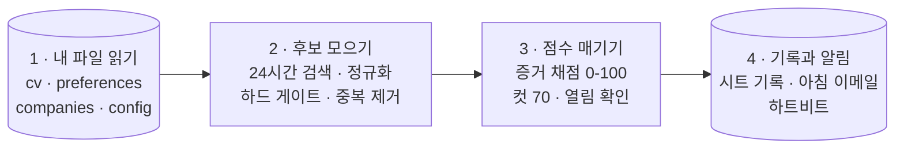

# catch-before-jobs-vanish

[](LICENSE)

**언어:** [English](README.md) · 한국어

EU에서 구직하다가 만들었습니다. 링크드인 "최근 24시간" 검색에서 새 공고가 몇
시간 만에 사라지는 바람에, 보기도 전에 놓치는 일이 반복됐거든요. 그래서 쫓아
다니는 일을 예약 에이전트에게 맡겼습니다. 매일 아침 링크드인과 인디드를 뒤져
공고마다 제 CV에 적힌 증거와 대조하고 100점 만점으로 점수를 매깁니다. 그중
상위 매칭이 아직 열려 있는지 확인한 뒤, 볼 가치가 있는 것만 이메일로
보내줍니다. 공고가 검색 창에서 밀려나 사라지기 전에요.

채점 기준표는 감으로 만든 게 아닙니다. **제가 실제로 지원해서 결과까지 아는
과거 실제 지원(Uber와 Google 서류 통과 건 포함)으로 백테스트해서 교정했습니다.**
[Claude](https://claude.com) Cowork 모드로 만들고 운영합니다. 이름이 곧 문제
정의입니다. **사라지기 전에 잡아라(catch before they vanish)**.

> **v3 (2026-07).** 한 달간 매일 돌린 실운영과 위 백테스트를 반영해 다시
> 썼습니다. 무엇이 왜 바뀌었는지: [`CHANGELOG.md`](CHANGELOG.md).

## 기능

| 기능 | 하는 일 |
|---|---|
| **증거 기반 채점** | JD의 실제 요구사항을 뽑아 `cv.md`에 적힌 증거와 하나씩 대조합니다 — 인상 점수 없음. 과거 실제 지원 백테스트로 교정 ([기준표](docs/fit-scoring-rubric.md)). |
| **채점기를 내가 통제** | **Skill calibration** 섹션이 credit 상한을 정하고("SQL은 대시보드 수준 — 데이터 엔지니어링 요건에 Direct 금지"), **Eligibility**의 knockout 조건이 무의미한 공고를 점수 전에 걸러냅니다. |
| **영구 링크 저장** | 공고별 `jobs/view/{id}` 링크를 저장합니다. 검색 URL은 저장하지 않습니다 — 24시간 필터 검색 URL은 움직이는 창이라 몇 시간이면 죽습니다. |
| **한 공고 = 한 행, 영원히** | 지문(fingerprint) 3개를 시트 전체 행과 대조합니다. 시간 창 없음 — 실운영에서 같은 공고를 세 번 쌓았던 48시간 창 규칙을 교체한 결과입니다. |
| **열림 확인** | 80점 초과 공고는 발송 전에 아직 열려 있는지 확인합니다 — 죽은 공고에 지원하는 일이 없게. |
| **살아 있고, 따져볼 수 있는 운영** | 매칭 0건이어도 "System alive"를 보내고, 매 실행 끝에 리포트 체크리스트가 붙습니다. 시트에 직접 적는 지원 결과(`Applied` / `Passed - CV` / ...)는 그대로 outcome funnel이 됩니다 (cold와 referral은 분리). |

## 작동 방식

매일 아침 예약 작업 하나가 크게 4단계로 돕니다:



앞의 세 단계는 읽기만 합니다. 쓰기는 전부 4단계에서만 일어나서, 실행이 도중에
죽어도 반쯤 된 일이 남지 않습니다. 속을 들여다보면 이 4단계는 목적이 하나씩인
10개 스텝으로 나뉩니다 — 전체 지도와 각 선택의 이유는
[`docs/architecture.md`](docs/architecture.md)에 있습니다.

규칙 소스는 스케줄러 프롬프트([로직](scheduler-prompt-template.md), 절대 안
고침)와 [`your-input/`](your-input)(내 데이터, 실행 시점에 읽음), 딱
둘입니다. 구글 시트에는 규칙이 아니라 기록만 남습니다.

에이전트 프롬프트 공개 자체는 이제 흔합니다. 이 레포가 더하는 것은 **운영
기록**입니다. 한 달을 매일 돌리고 실제 지원 결과로 백테스트해서 공개 rubric을
교정했습니다. 바꾼 내용과 이유는 전부 [changelog](CHANGELOG.md)와
[기준표](docs/fit-scoring-rubric.md)에 적어 뒀습니다.

## 데모

*(준비 중: [`your-input/`](your-input)의 가공 인물로 파이프라인을 한 번 완주한
결과, 그러니까 아침 이메일과 시트를 스크린샷으로 올릴 예정입니다.)*

## 필요한 것

설치하는 프로그램이 아니라 AI 에이전트가 매일 아침 실행하는 작업 지시문입니다.
서버도, 코드 설정도 필요 없습니다.

- 매일 예약 작업(scheduled task)을 돌릴 수 있는 AI 에이전트. Claude **Cowork
  모드**로 만들고 테스트했습니다.
- Claude에 커넥터(connector) 3개 연결: 채용 사이트를 읽을 **Chrome**, 시트에
  기록할 **Google Drive**, 알림을 보낼 **Gmail**.
- 구글 계정과 알림 받을 이메일 주소.

## 빠른 시작

**가장 빠른 길**: 미리 채워 둔 예시(전부 지어낸 가공 인물)를 복사해서
고치세요.

```bash
git clone https://github.com/<본인-아이디>/catch-before-jobs-vanish.git
cd catch-before-jobs-vanish/your-input
cp cv.example.md cv.md && cp preferences.example.md preferences.md
cp companies.example.md companies.md && cp config.example.md config.md
```

그다음 탭 2개짜리 구글 시트를 만들고 프롬프트를 매일 예약 작업에 붙여넣은 뒤,
내일 아침 이메일을 기다리면 됩니다.

**전체 안내** (30분 코스, git이나 코딩 지식 없이 따라올 수 있게 썼습니다):
**[setup.md](setup.md)**.

## 프로젝트 구조

```
catch-before-jobs-vanish/
├── README.md · README.ko-KR.md      이 페이지 (영어 · 한국어)
├── CHANGELOG.md                     버전 기록 — 변경마다 이유를 함께 적음
├── setup.md                         30분 설치 안내 (영어 + 한국어)
├── scheduler-prompt-template.md     매일 도는 프롬프트 — 로직 전부, 개인값 0
├── docs/
│   ├── architecture.md              파이프라인 전체 지도와 그렇게 만든 이유
│   └── fit-scoring-rubric.md        채점 기준표 + 백테스트가 바꾼 것
├── your-input/                      내 개인 데이터 자리 (gitignore — 예시만 공개)
│   ├── README.md                    4개 파일에 각각 뭘 넣는지
│   └── *.example.md                 채워진 예시 (가공 인물) — 복사해서 수정
├── LICENSE                          MIT
└── .gitignore                       실제 개인 파일이 git에 못 들어가게 막음
```

## 기술 스택

| 층 | 선택 |
|---|---|
| 실행 | Claude (Cowork 모드) — 프로그램이 아니라 예약된 프롬프트 |
| 수집 | Chrome 커넥터로 링크드인 + 인디드. 문서화는 개념 수준까지만 |
| 기록 | Google Drive 커넥터로 구글 시트 (탭 2개) |
| 알림 | Gmail 커넥터, draft-then-send |
| 설정 | `your-input/`의 마크다운 파일 |
| 서버 / 코드 | 없음 |

## 자주 묻는 질문

**대신 지원까지 해주나요?** 아니요, 일부러 안 합니다. 지원은 판단이 필요한
일입니다. 이 도구가 하는 일은 공고를 놓치지 않게 하고 아침마다 검색을 반복하는
수고를 없애는 데까지입니다.

**링크드인에서 이래도 되나요?** 이 레포는 수집을 개념 수준까지만 문서화하고
상세 레시피는 싣지 않습니다. 본인 계정으로 사람의 속도에 맞춰 쓰는 것도, 각
사이트의 약관을 지키는 것도 사용자 몫입니다.

**점수가 높으면 서류에 붙나요?** 아니요. 백테스트 결과가 정확히 그랬습니다.
점수는 지원 노력을 어디에 쓸지 정하는 우선순위 신호입니다. 나머지는 outcome
loop가 측정합니다.

**Claude 말고 다른 에이전트도 되나요?** 웹 탐색, 구글 시트 읽고 쓰기, 이메일
발송, 매일 예약 실행이 되는 에이전트라면 됩니다.

## 만든 사람

프로덕트 매니저입니다. 제 EU 구직에 쓰려고 만들었고 그 뒤로 매일 아침 돌고
있습니다. 만들면서 내린 결정과 실패·복구의 긴 이야기는 따로 정리 중입니다.
공개되면 여기에 링크를 추가할게요.

## 면책

- 링크드인, 인디드, Google을 비롯해 본문에 등장하는 어떤 회사와도 무관한 개인
  프로젝트입니다.
- 수집은 개념 수준까지만 문서화합니다. 각 사이트의 약관을 지키는 책임은
  사용자에게 있습니다.
- Fit 점수는 우선순위 신호이지, 서류 통과 예측이 아닙니다.
- 구직 결과를 보장하지 않습니다.

## 라이선스

[MIT](LICENSE). 포크해서 고치고 직접 운영하세요.
