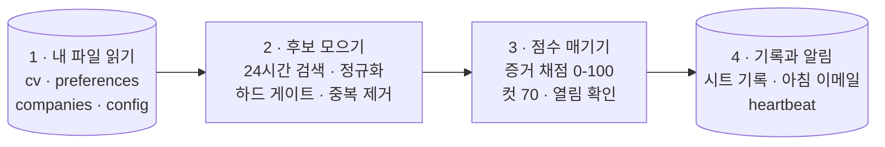

# catch-before-jobs-vanish

[](LICENSE)

**언어:** [English](README.md) · 한국어

**좋은 공고는 금방 닫힙니다. 닫히기 전에 잡으세요 — catch before jobs
vanish.**

**이 프로젝트의 목표는 하나입니다. 내 경력에 정말 맞는 공고를 게시 후 24시간
안에 찾아내는 것.** LinkedIn 알림처럼 단순한 키워드 매칭으로 공고를 쏟아내지
않고, auto-apply 봇처럼 지원서를 대신 내지도 않습니다. 대신 공고마다 핵심
요구사항을 CV에 기록된 경력·성과와 항목별로 대조해 100점 만점으로 평가하고,
기준 점수를 넘긴 공고만 남깁니다. 이 평가 기준은 임의로 만든 규칙이 아니라,
Uber와 Google 서류 통과 사례를 포함해 결과가 확인된 과거 실제 지원으로
백테스트해 보정한 것입니다. 설정을 마치면 [Claude](https://claude.com) 예약
작업으로 자동 운영됩니다. 매일 LinkedIn과 Indeed, 관심 회사의 채용 페이지를
확인하고, 추천 공고와 점수를 이메일 한 통으로 정리해 보냅니다.

> **v3 (2026-07).** 한 달간 매일 돌린 실운영과 위 백테스트를 반영해 다시
> 썼습니다. 무엇이 왜 바뀌었는지는 [`CHANGELOG.md`](CHANGELOG.md)에 적어
> 뒀습니다.

## 데모

*(준비 중: [`your-input/`](your-input)의 가공 인물로 파이프라인을 한 번 완주한
결과, 그러니까 아침 이메일과 시트를 스크린샷으로 올릴 예정입니다.)*

## 뭘 하는 도구인가

매일 도는 job-alert 파이프라인입니다. 크게 네 가지를 해줍니다.

| 기능 | 한 줄 설명 |
|---|---|
| **증거 기반 fit scoring** | 공고마다 내 CV에 실제로 적힌 것과 요구사항 하나하나를 대조해 채점합니다 — 단어가 겹치는지가 아니라 증거가 있는지를 봅니다. 왜 그 점수인지는 Fit Reason에 적힙니다 ([기준표](skills/job-alert/fit-scoring-rubric.md)). |
| **Skill calibration** | 스킬마다 "실제로 어디까지 해봤는지"를 적어 두면, 채점기는 거기 적힌 수준을 넘겨 점수를 줄 수 없습니다. 초안은 에이전트가 CV에서 뜨고, 확정은 내가 합니다. |
| **데일리 스캔** | 매일 아침 LinkedIn + Indeed(최근 24시간)와 지금 노리는 회사의 채용 페이지를 확인합니다 — 공고가 검색 결과에서 밀려나기 전에 잡습니다. 일주일에 하루는 나머지 관심 회사까지 훑습니다. |
| **한 공고 = 한 행** | 한 번 본 공고는 다시 새 공고로 나타나지 않습니다 — 다른 사이트에 다시 올라오거나 링크가 바뀌어도 마찬가지입니다. |

## 뭐가 다른가

나 한 사람만 챙기는 headhunter를 두는 셈입니다. 매일 아침 시장을 지켜보다가,
내 경력 증거가 실제로 받쳐 주는 공고만 골라 보여 줍니다.

그리고 **대신 지원하지 않습니다**. 이 도구는 공고를 놓치지 않게 하고 아침마다
검색을 반복하는 수고를 없애는 데서 멈춥니다. 지원할지 말지는 판단이 필요한
일이라 내가 정합니다.

에이전트 프롬프트 공개 자체는 이제 흔합니다. 이 repo에는 **운영 기록**까지 들어
있습니다. 한 달을 매일 돌리고 과거 실제 지원(Uber·Google 서류 통과 건
포함)으로 백테스트해서 공개 rubric을 교정했습니다. 바꾼 내용과 이유는 전부
[changelog](CHANGELOG.md)와 [기준표](skills/job-alert/fit-scoring-rubric.md)에
적어 뒀습니다.

## 시작하는 법

설치하는 프로그램이 아닙니다. AI 에이전트가 매일 아침 실행하는 작업
지시문입니다. 그래서 서버도, 코드 설정도 필요 없습니다. 처음이면 30분 정도
잡으세요. 준비물은 셋입니다.

- 매일 예약 작업(scheduled task)을 돌릴 수 있는 AI 에이전트. Claude **Cowork
  모드**로 만들고 테스트했습니다.
- Claude에 connector 3개 연결 (connector는 Claude를 내 계정의 다른 서비스에
  이어 주는 공식 연결 기능입니다): 채용 사이트를 읽을 **Chrome**, 시트에
  기록할 **Google Drive**, 알림을 보낼 **Gmail**.
- 구글 계정과 알림 받을 이메일 주소.

그다음은 네 단계입니다. git이나 코딩 지식 없이 따라올 수 있게 쓴 전체 안내는
[setup.md 한국어판](setup.md#설정-한국어)에 있습니다:

1. **repo 받기** — `git clone`, 또는 이 페이지에서 Code → Download ZIP.
2. **탭 2개짜리 구글 시트 만들기**, 그리고 시트 ID를 `your-input/config.md`에
   붙여넣기 — [setup.md 2단계](setup.md#2단계--구글-시트-만들기).
3. **[`your-input/`](your-input) 채우기** — `*.example.md` 4개(전부 지어낸 가공
   인물)를 복사해 본인 내용으로 고치기.
4. **에이전트에 넘기기.** Claude Code라면 명령 두 줄로 `job-alert` skill이
   설치됩니다:

   ```
   /plugin marketplace add Journey-512/catch-before-jobs-vanish
   /plugin install catch-before-jobs-vanish@catch-before-jobs-vanish
   ```

   Cowork를 비롯한 다른 에이전트라면
   [`skills/job-alert/SKILL.md`](skills/job-alert/SKILL.md)의 프롬프트 블록을
   복사해 매일 예약 작업에 넣으면 됩니다 (한국어 안내:
   [`docs/skill.ko-KR.md`](docs/skill.ko-KR.md)) —
   [setup.md 4단계](setup.md#4단계--에이전트에-파이프라인-넘기기).

그다음 한 번 수동으로 실행해 보고(또는 내일 아침 이메일을 기다리고),
[setup.md 5단계](setup.md#5단계--테스트-실행)의 체크리스트와 맞춰 보세요.

## 쓰는 법

가공 인물의 어느 아침입니다. 서울에서 EU 이직을 준비하는 여행·모빌리티 3년차
PM입니다. EU work authorization이 있고, EU 전역의 Product Manager 자리를
노립니다.

1. **9시, 이메일이 도착합니다.** Top(85점 이상)과 Strong(70-84점)만 담겨
   있습니다. 예를 들어 Aiming 회사의 Product Manager 공고가 86점을 받았습니다.
   한 줄짜리 Fit Reason에 어떤 요건이 맞았는지, 가장 큰 공백이 뭔지, 지원서에서
   앞세울 각도가 뭔지 적혀 있습니다. headhunter 공고에는 `[Headhunter]` 태그가,
   자동 추가된 회사에는 거부(veto) 안내가 붙습니다. 공고가 없는 날에도 메일은
   옵니다: "No new matches. System alive."
2. **전체 그림이 궁금하면 시트를 엽니다.** 발견된 공고는 전부 행으로 남습니다.
   이메일에서 빠진 것도 `Excluded (...)`나 `Closed (날짜)` 표시와 함께
   남습니다. "이 공고는 왜 이메일에 없지?" 싶을 때 시트를 보면 언제나 답이
   있습니다.
3. **지원하고, 기록합니다.** Status 열에 `Applied`(referral로 지원했으면
   `Applied (referral)`)를 적고, 결과가 나오는 대로 `Passed - CV`나
   `Rejected - CV`로 갱신합니다.
4. **일주일에 한 번, deep-scan 날 이메일에 funnel 요약이 붙습니다.** 직접 적어
   둔 Status를 보고 점수가 정말 지원할 가치가 있는 공고를 찾아내고 있는지
   보여 줍니다. 이 루프가 어떻게 도는지는 [작동 방식](#작동-방식)에 적어
   뒀습니다.

## 작동 방식

매일 아침 예약 작업 하나가 크게 4단계로 돕니다:



앞의 세 단계는 읽기만 합니다. 쓰기는 전부 4단계에서만 일어나서, 실행이 도중에
죽어도 하다 만 상태로 남는 게 없습니다. 속을 들여다보면 이 4단계는 목적이
하나씩인 step 10개로 나뉩니다. 그 10개가 어떤 순서로 도는지는 프롬프트
[`skills/job-alert/SKILL.md`](skills/job-alert/SKILL.md)에 그대로 적혀 있습니다
— 한국어 안내는 [`docs/skill.ko-KR.md`](docs/skill.ko-KR.md).

규칙은 딱 두 곳에서 옵니다. 파이프라인 프롬프트(로직, 절대 안 고침)와
[`your-input/`](your-input)(내 데이터, 실행 시점에 읽음)입니다. 구글 시트에는
규칙이 없고 기록만 쌓입니다. 채점의 세부, 그러니까 credit 배점 단계와 **Core /
Transferable(상한 포함) / Gap** calibration 분류는
[기준표](skills/job-alert/fit-scoring-rubric.md)에 있습니다.

한 달 동안 매일 돌리면서 규칙으로 굳힌 안전장치는 넷입니다.

- **검색 URL이 아니라 영구 링크** — 24시간 필터가 걸린 검색 URL은 기준 시각이
  계속 밀려서 몇 시간이면 죽습니다. 공고별 `jobs/view/{id}` 링크는 안 죽습니다.
- **한 공고 = 한 행, 영원히** — 지문(fingerprint) 3개(LinkedIn jobId / 채용
  페이지 job-ID / 회사+정규화 직함)를 기간 제한 없이 시트의 모든 행과
  대조합니다.
- **열림 확인** — 80점을 넘는 공고는 아직 열려 있는지 확인하고 나서 보냅니다.
  이미 닫힌 공고에 지원하는 일을 막기 위해서입니다.
- **heartbeat(생존 신호)** — 매칭 0건이어도 "No new matches. System alive."를
  보냅니다. 그래서 메일이 안 온 날은 매칭이 0건인 날이 아니라 어딘가 고장 난
  날입니다.

**Outcome loop.** 내가 직접 적는 Status 열(`Applied` / `Passed - CV` /
`Rejected - CV` / `Lost`, 해당되면 `(referral)` 접미)이 그대로 라벨 데이터가
됩니다. deep-scan 날 이메일에 점수 구간별 CV-pass rate를 cold/referral로 나눠
표본 수와 함께 붙여 줍니다. 파이프라인은 재서 알려 주기만 합니다. 규칙을
바꿀지는 언제나 사람이 정합니다. (이 측정으로 다음에 무엇을 할 수 있는지는
[Roadmap](#roadmap)에 적어 뒀습니다.)

## Roadmap

지금의 outcome loop는 숫자를 재서 보여 줄 뿐입니다. 그 숫자를 보고 무엇을
바꿀지는 사용자가 판단합니다. 결과가 두세 건 수준을 넘어 표본이라 부를 만한
n으로 쌓이면, 미리 설계해 둔 기능 하나를 켤 계획입니다. **지원 결과와 지금
설정을 대조한 조정 제안**입니다. 그동안 기록된 결과를 놓고 파이프라인이 초안까지
만들고, 승인할지 무시할지는 사용자가 정합니다.

- 어떤 패턴이 서류에서 계속 떨어진다 → `cv.md`의 해당 Skill calibration 줄을
  더 엄격하게 고치거나 cap을 낮추자는 제안.
- 점수는 계속 높은데 계속 지원을 건너뛰게 된다 → 그 패턴이 안 올라오게
  `preferences.md`를 보완하자는 제안.
- 어떤 패턴이 계속 통과한다 → `companies.md`의 Aiming 후보로 올리자는 제안.

제안을 낼 때 지키는 규칙 셋을 정해 뒀습니다. 제안마다 사용자 승인 게이트를
거치니 자동으로 적용되는 일은 없습니다. 제안마다 표본 수 n을 같이 적습니다. 몇
건 우연히 겹친 것을 패턴으로 읽는 일을 막기 위해서입니다. 그리고 프롬프트와
rubric은 계속 frozen이라, 제안이 손대는 파일은 내 데이터 파일뿐입니다.

## 프로젝트 구조

```
catch-before-jobs-vanish/
├── README.md · README.ko-KR.md      이 페이지 (영어 · 한국어)
├── CHANGELOG.md                     버전 기록 — 변경마다 이유를 함께 적음
├── setup.md                         30분 설치 안내 (영어 + 한국어)
├── skills/
│   └── job-alert/
│       ├── SKILL.md                 매일 도는 파이프라인 프롬프트 — 로직 전부, 개인값 0
│       └── fit-scoring-rubric.md    채점 기준표 + 백테스트가 바꾼 것
├── .claude-plugin/                  명령 두 줄 설치를 가능하게 하는 manifest 파일
├── docs/
│   └── skill.ko-KR.md               파이프라인 프롬프트의 한국어 안내
├── your-input/                      내 개인 데이터 자리 (gitignore — 예시만 공개)
│   ├── README.md                    4개 파일에 각각 뭘 넣는지
│   └── *.example.md                 채워진 예시 (가공 인물) — 복사해서 수정
├── LICENSE                          MIT
└── .gitignore                       실제 개인 파일이 git에 못 들어가게 막음
```

## 기술 스택

| 층 | 선택 |
|---|---|
| 실행 | Claude — Cowork 모드의 예약 프롬프트(만든 사람이 쓰는 방식), 또는 Claude Code의 `job-alert` skill(명령 두 줄 설치) |
| 수집 | Chrome connector로 LinkedIn + Indeed. 어떻게 모으는지는 개념까지만 적음 |
| 기록 | Google Drive connector로 구글 시트 (탭 2개) |
| 알림 | Gmail connector, draft-then-send |
| 설정 | `your-input/`의 Markdown 파일 |
| 서버 / 코드 | 없음 |

## 자주 묻는 질문

**LinkedIn 공고를 이렇게 읽어도 되나요?** 이 repo는 공고를 어떻게 모으는지
개념만 적어 뒀습니다. 그대로 따라 하면 되는 절차는 싣지 않았습니다. 본인
계정으로 사람이 하는 속도에 맞춰 쓰는 일도, 사이트마다 약관을 지키는 일도
사용자가 챙겨야 합니다.

**점수가 높으면 서류에 붙나요?** 아니요. 백테스트 결과가 정확히 그랬습니다.
점수는 지원 노력을 어디에 쓸지 정하는 우선순위 신호입니다. 나머지는 outcome
loop가 측정합니다.

**Claude 말고 다른 에이전트도 되나요?** 웹 탐색, 구글 시트 읽고 쓰기, 이메일
발송, 매일 예약 실행이 되는 에이전트라면 됩니다.

## 만든 사람

Product Manager입니다. 제 EU 구직 때 만들었고, 파이프라인은 그 뒤로도 매일
아침 돌고 있습니다. 같은 상황의 PM이라면 누구든 쓸 수 있게 공개해 뒀습니다.
만들면서 어떤 결정을 내렸고 무엇이 실패했고 어떻게 되돌렸는지는 따로 길게
정리하고 있습니다. 공개되면 여기에 링크를 추가할게요.

## 면책

- LinkedIn, Indeed, Google을 비롯해 본문에 등장하는 어떤 회사와도 무관한 개인
  프로젝트입니다.
- 사용자 본인 계정과 컴퓨터에서 도는 오픈소스입니다. 따로 돌아가는 서버가
  없고, 만든 사람은 사용자의 어떤 데이터도 수집·저장·접근하지 않습니다. 공고도,
  시트도, 이메일도 전부 사용자 계정에만 있습니다.
- 공고를 어떻게 모으는지는 개념까지만 적어 뒀습니다. 각 사이트의 약관을 지키는
  책임은 사용자에게 있고, 약관 위반으로 생기는 계정 제한 같은 불이익도
  마찬가지입니다.
- Fit Score는 우선순위 신호이지, 서류 통과 예측이 아닙니다.
- AI 에이전트가 나 대신 움직이는 도구입니다. 매일 아침 에이전트가 쓰고 보낸
  것을 확인하는 최종 책임은 사용자에게 있습니다.
- 구직 결과를 보장하지 않습니다.

## 라이선스

[MIT](LICENSE). fork해서 고치고 직접 운영하세요.

## 연락처

[LinkedIn](https://www.linkedin.com/in/journeymjlee/) ·
[hemegi.lee@gmail.com](mailto:hemegi.lee@gmail.com)
