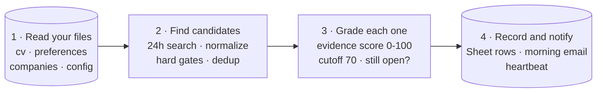

# catch-before-jobs-vanish

[](LICENSE)

**Language:** English · [한국어](README.ko-KR.md)

I built this while job-hunting in the EU: fresh postings kept vanishing from
LinkedIn's "last 24 hours" search before I ever saw them. So I turned the
chase into a scheduled agent. Every morning it searches LinkedIn + Indeed,
scores each posting against the evidence in my CV on a 100-point rubric,
verifies that top matches are still open, and emails me only what's worth my
time — before the postings rotate out of the search window and disappear.

The rubric isn't guesswork: it was corrected by a backtest of **29 of my real
applications with known outcomes, including CV screens passed at Uber and
Google**. Built and run with [Claude](https://claude.com) in Cowork mode. The
name is the problem statement: **catch them before they vanish**.

> **v3 (2026-07).** Rewritten after a month of daily production runs and the
> backtest above. What changed and why: [`CHANGELOG.md`](CHANGELOG.md).

## Features

| Feature | What it does |
|---|---|
| **Evidence-based scoring** | Extracts each JD's actual requirements and grades them against written evidence in your `cv.md` — no impression scores. Corrected by the 29-application backtest ([rubric](docs/fit-scoring-rubric.md)). |
| **You control the scorer** | A **Skill calibration** section caps how much credit the scorer may give ("SQL: dashboards only — never Direct for data engineering"); **Eligibility** knockouts drop pointless postings at the gate. |
| **Permalink capture** | Saves per-posting `jobs/view/{id}` links, never search URLs — a 24h-filtered search URL is a moving window and dies within hours. |
| **One posting = one row, forever** | Dedup matches three fingerprints against the whole Sheet with no time window — the rule that replaced a 48-hour window that produced triplicate rows in production. |
| **Liveness check** | Everything scoring above 80 is verified still open before the email goes out — no more applying to ghosts. |
| **Alive and auditable** | Zero matches still sends "System alive"; every run ends with a report checklist; your Status edits (`Applied` / `Passed - CV` / ...) become an outcome funnel, cold and referral kept separate. |

## How it works

Four stages, run as one scheduled task every morning:



The first three stages only read — every write happens in stage 4, so a run
that dies mid-way leaves nothing half-done. Under the hood the stages split
into ten single-purpose steps; the full map, with the reasoning behind each
choice, is [`docs/architecture.md`](docs/architecture.md).

The pipeline has exactly **two rule sources**: the scheduler prompt
([the logic](scheduler-prompt-template.md), never edited) and
[`your-input/`](your-input) (your data, read at runtime). The Google Sheet
holds records, never rules.

Plenty of projects publish agent prompts — that part is commodity. What this
repo adds is the **operating record**: a public rubric that a month of daily
runs and a real-outcome backtest actually corrected, with every change and its
reason written down in the [changelog](CHANGELOG.md) and the
[rubric](docs/fit-scoring-rubric.md).

## Demo

*(Coming soon: the example persona from [`your-input/`](your-input) run
through a full pipeline pass — the morning email and the Sheet it writes, as
screenshots.)*

## Requirements

Not a program you install — a work order an AI agent runs every morning. No
server, no code setup.

- An AI agent that can run a daily scheduled task — built and tested with
  Claude in Cowork mode.
- Three connectors enabled in Claude: **Chrome** (reads job sites), **Google
  Drive** (writes the Sheet), **Gmail** (sends the alert).
- A Google account and an email address.

## Quick start

**Fastest path** — copy the filled-in examples (a fully fictional demo
persona) and edit:

```bash
git clone https://github.com/<your-username>/catch-before-jobs-vanish.git
cd catch-before-jobs-vanish/your-input
cp cv.example.md cv.md && cp preferences.example.md preferences.md
cp companies.example.md companies.md && cp config.example.md config.md
```

Then create a 2-tab Google Sheet, paste the prompt into a daily scheduled
task, and wait for tomorrow's email.

**Full walkthrough** (about 30 minutes, no git or coding knowledge assumed):
**[setup.md](setup.md)**.

## Project structure

```
catch-before-jobs-vanish/
├── README.md · README.ko-KR.md      this page (English · Korean)
├── CHANGELOG.md                     version history, with the reason next to each change
├── setup.md                         30-minute setup walkthrough (EN + KO)
├── scheduler-prompt-template.md     the daily prompt — all of the logic, zero personal data
├── docs/
│   ├── architecture.md              the full pipeline map, step by step, and the reasoning
│   └── fit-scoring-rubric.md        the scoring rubric + what the backtest changed
├── your-input/                      your personal data (gitignored — only examples are public)
│   ├── README.md                    what goes in each of the four files
│   └── *.example.md                 filled-in examples (fictional persona) — copy and edit
├── LICENSE                          MIT
└── .gitignore                       keeps your real files out of git
```

## Tech stack

| Layer | Choice |
|---|---|
| Runtime | Claude (Cowork mode) — a scheduled prompt, not a program |
| Collection | LinkedIn + Indeed through the Chrome connector; described at concept level |
| Records | Google Sheets (2 tabs) through the Google Drive connector |
| Alerts | Gmail connector, draft-then-send |
| Configuration | Plain Markdown files in `your-input/` |
| Servers / code | None |

## FAQ

**Does it apply for me?** No — on purpose. Applying is judgment; this tool's
job is to make sure you never miss the window and never waste a morning
re-searching.

**Is this allowed on LinkedIn?** This repo documents collection at the
concept level only and ships no scraping recipes. Run it with your own
account, at a human pace, and comply with each site's terms.

**Will the score predict whether I pass the CV screen?** No, and the backtest
says exactly that. The score is a priority signal for where to spend
application effort; the outcome loop exists to measure the rest.

**Can I use an agent other than Claude?** Yes, if it can browse the web,
read/write a Google Sheet, send email, and run on a daily schedule.

## About

I'm a product manager. I built this for my own EU job search, and it has run
every morning since. The longer build story — the decisions, failures, and
recoveries behind it — is being written up separately; a link will be added
here once it's published.

## Disclaimer

- Not affiliated with LinkedIn, Indeed, Google, or any company mentioned.
- Collection is documented at concept level; you are responsible for
  complying with each site's terms of service.
- Fit scores are a prioritization signal, not a prediction of screening
  outcomes.
- No guarantee of job-search results.

## License

[MIT](LICENSE). Fork it, adapt it, ship your own.
