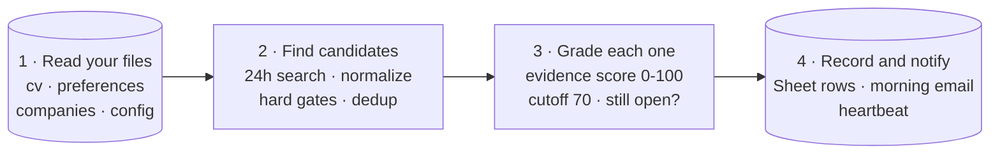

# catch-before-jobs-vanish

[](LICENSE)

**Language:** English · [한국어](README.ko-KR.md)

**Good postings close fast. Catch them before they vanish.**

**This project has one goal: find the postings that truly fit your career,
within 24 hours of going up.** It doesn't flood you with keyword matches
like a LinkedIn alert, and it doesn't submit applications for you like an
auto-apply bot. Instead, it checks each posting's key requirements against
the experience and results recorded in your CV, scores it out of 100, and
keeps only what clears the bar. That rubric isn't a made-up rule set: it was
backtested and calibrated on **past real applications with known outcomes,
including CV screens passed at Uber and Google**. Once set up, it runs
itself as a scheduled [Claude](https://claude.com) task — every day it
checks LinkedIn, Indeed, and your target companies' careers pages, then
sends one email with the recommended postings and their scores.

> **v3 (2026-07).** Rewritten after a month of daily production runs and the
> backtest above. What changed and why: [`CHANGELOG.md`](CHANGELOG.md).

## Demo

*(Coming soon: the example persona from [`your-input/`](your-input) run
through a full pipeline pass — the morning email and the Sheet it writes, as
screenshots.)*

## What is this

A daily job-alert pipeline. Four things it does for you:

| Feature | In one line |
|---|---|
| **Evidence-based fit scoring** | Every posting is graded against what your CV actually shows, requirement by requirement — no buzzword matching, and the Fit Reason tells you why it scored what it did ([rubric](skills/job-alert/fit-scoring-rubric.md)). |
| **Skill calibration** | You state how far you've really gone with each skill, and the scorer can never credit you above that line. An agent drafts the list from your CV; you confirm it. |
| **Daily scan** | Checks LinkedIn + Indeed (last 24 hours) and the careers pages of the companies you're gunning for, every morning — before postings rotate out of the search window; once a week it sweeps the rest of your watchlist. |
| **One posting = one row** | A posting you've already seen never comes back as new — whichever site it resurfaces on, however its link has changed. |

## Why it's different

Think of it as hiring a headhunter who works only for you. It watches the
market every morning and points your attention at the postings your career
evidence actually supports.

And it does **not** apply for you — on purpose. Its job ends at making sure
you never miss the window and never waste a morning re-searching; applying
is judgment, and the judgment stays yours.

Plenty of projects publish agent prompts — that part is commodity. What this
repo adds is the **operating record**: a public rubric that a month of daily
runs and a backtest of past real applications (CV screens passed at Uber and
Google included) actually corrected, with every change and its reason written
down in the [changelog](CHANGELOG.md) and the
[rubric](skills/job-alert/fit-scoring-rubric.md).

## How to start

Not a program you install — a work order an AI agent runs every morning. No
server, no code setup; plan on about 30 minutes the first time. You need:

- An AI agent that can run a daily scheduled task — built and tested with
  Claude in Cowork mode.
- Three connectors enabled in Claude: **Chrome** (reads job sites), **Google
  Drive** (writes the Sheet), **Gmail** (sends the alert).
- A Google account and an email address for the alerts.

Then four steps — [setup.md](setup.md) walks through each one, no git or
coding knowledge assumed:

1. **Get the repo** — `git clone`, or Code → Download ZIP on this page.
2. **Create a 2-tab Google Sheet** and paste its Sheet ID into
   `your-input/config.md` —
   [setup.md, Step 2](setup.md#step-2--create-the-google-sheet).
3. **Fill in [`your-input/`](your-input)** — copy the four `*.example.md`
   files (a fully fictional demo persona) and edit them with your details.
4. **Hand it to your agent.** In Claude Code, two commands install it as the
   `job-alert` skill:

   ```
   /plugin marketplace add Journey-512/catch-before-jobs-vanish
   /plugin install catch-before-jobs-vanish@catch-before-jobs-vanish
   ```

   On Cowork or any other agent, paste the prompt block from
   [`skills/job-alert/SKILL.md`](skills/job-alert/SKILL.md) into a daily
   scheduled task
   ([setup.md, Step 4](setup.md#step-4--hand-the-pipeline-to-your-agent)).

Then trigger it once manually (or wait for tomorrow's email) and check the
results against [setup.md, Step 5](setup.md#step-5--test-run).

## How to use

A morning with the example persona — a fictional 3-year travel & mobility PM
applying from Seoul with EU work authorization, targeting Product Manager
roles across the EU:

1. **9:00 — the email arrives.** Only Top (85+) and Strong (70-84) matches;
   say a Product Manager posting at an Aiming company scored 86,
   with a one-line Fit Reason: which requirements matched, the main gap, the angle
   to lead with. Headhunter posts are tagged `[Headhunter]`; auto-added
   companies come with a veto prompt. On a quiet day the mail still arrives:
   "No new matches. System alive."
2. **They open the Sheet** when they want the full picture: every finding is
   a row, including what the email left out as `Excluded (...)` or
   `Closed (date)` — so "why isn't this in the email?" always has an answer.
3. **They apply, and write it down.** `Applied` in the Status column
   (`Applied (referral)` if someone referred them), later updated to
   `Passed - CV` or `Rejected - CV`.
4. **Once a week, the deep-scan email adds a funnel summary** built from
   those Status entries — is the score actually finding the postings worth
   their time? How that loop works: [How it works](#how-it-works).

## How it works

Four stages, run as one scheduled task every morning:



The first three stages only read — every write happens in stage 4, so a run
that dies mid-way leaves nothing half-done. Under the hood the stages split
into ten single-purpose steps; the prompt itself is the map:
[`skills/job-alert/SKILL.md`](skills/job-alert/SKILL.md), with a Korean guide
at [`docs/skill.ko-KR.md`](docs/skill.ko-KR.md).

The pipeline has exactly **two rule sources**: the pipeline prompt (the
logic, never edited) and [`your-input/`](your-input) (your data, read at
runtime). The Google Sheet holds records, never rules. The scoring detail —
the credit ladder and the **Core / Transferable (with caps) / Gap**
calibration classes — lives in the
[rubric](skills/job-alert/fit-scoring-rubric.md).

A few safeguards a month of production runs promoted into rules:

- **Permalinks, never search URLs** — a 24h-filtered search URL is a moving
  window that dies within hours; per-posting `jobs/view/{id}` links don't.
- **One posting = one row, forever** — three fingerprints (LinkedIn jobId /
  careers job-ID / company + normalized title) are matched against the whole
  Sheet, with no time window.
- **Liveness check** — everything scoring above 80 is verified still open
  before the email goes out. No more applying to ghosts.
- **Heartbeat** — zero matches still sends "No new matches. System alive.",
  so silence always means breakage, never zero results.

**The outcome loop.** The Status column you keep by hand (`Applied` /
`Passed - CV` / `Rejected - CV` / `Lost`, plus a `(referral)` suffix where it
applies) doubles as label data. On the deep-scan day the email appends a
funnel summary — CV-pass rate per score band, cold and referral separated,
always with sample sizes. The pipeline measures and reports; changing the
rules stays your call. (What that measuring enables next:
[Roadmap](#roadmap).)

## Roadmap

Today the outcome loop measures and reports; what to change with those
numbers stays your read. Once enough outcomes accumulate — real sample
sizes, not three data points — one planned feature switches on: **tuning
suggestions from outcome comparison**. The run compares your recorded
outcomes against your current settings and drafts a suggestion; you approve
or ignore it.

- A pattern keeps failing the CV screen → a suggested tightening of that
  Skill calibration line or cap in `cv.md`.
- A pattern keeps scoring high while you keep skipping it → a suggested
  `preferences.md` change so it stops surfacing.
- A pattern keeps converting → a suggested Aiming candidate in
  `companies.md`.

Three rules hold for every suggestion: nothing is applied automatically —
each one passes your approval gate. Every suggestion carries its sample size
(n), so a fluke can't pose as a pattern. And the prompt and rubric stay
frozen — suggestions only ever touch your data files.

## Project structure

```
catch-before-jobs-vanish/
├── README.md · README.ko-KR.md      this page (English · Korean)
├── CHANGELOG.md                     version history, with the reason next to each change
├── setup.md                         30-minute setup walkthrough (EN + KO)
├── skills/
│   └── job-alert/
│       ├── SKILL.md                 the daily pipeline prompt — all of the logic, zero personal data
│       └── fit-scoring-rubric.md    the scoring rubric + what the backtest changed
├── .claude-plugin/                  manifest files behind the two-command install
├── docs/
│   └── skill.ko-KR.md               Korean guide to the pipeline prompt
├── your-input/                      your personal data (gitignored — only examples are public)
│   ├── README.md                    what goes in each of the four files
│   └── *.example.md                 filled-in examples (fictional persona) — copy and edit
├── LICENSE                          MIT
└── .gitignore                       keeps your real files out of git
```

## Tech stack

| Layer | Choice |
|---|---|
| Runtime | Claude — a scheduled prompt in Cowork mode (how the author runs it), or the `job-alert` skill in Claude Code (two-command install) |
| Collection | LinkedIn + Indeed through the Chrome connector; described at concept level |
| Records | Google Sheets (2 tabs) through the Google Drive connector |
| Alerts | Gmail connector, draft-then-send |
| Configuration | Plain Markdown files in `your-input/` |
| Servers / code | None |

## FAQ

**Is this allowed on LinkedIn?** This repo documents collection at the
concept level only and ships no scraping recipes. Run it with your own
account, at a human pace, and comply with each site's terms.

**Will the score predict whether I pass the CV screen?** No, and the backtest
says exactly that. The score is a priority signal for where to spend
application effort; the outcome loop exists to measure the rest.

**Can I use an agent other than Claude?** Yes, if it can browse the web,
read/write a Google Sheet, send email, and run on a daily schedule.

## About

I'm a product manager. I built this during my own EU job search; the
pipeline has run every morning since, and it's public so that any PM in the
same spot can run it too. The longer build story — the decisions, failures, and
recoveries behind it — is being written up separately; a link will be added
here once it's published.

## Disclaimer

- Not affiliated with LinkedIn, Indeed, Google, or any company mentioned.
- Open source that runs locally, on your own accounts. There is no hosted
  service behind it, and the author never collects, stores, or accesses any
  of your data — postings, Sheet, and email all stay with you.
- Collection is documented at concept level; you are responsible for
  complying with each site's terms of service, and for any account
  restrictions that follow from breaking them.
- Fit scores are a prioritization signal, not a prediction of screening
  outcomes.
- An AI agent acts on your behalf here — reviewing what it wrote and sent
  each morning remains your responsibility.
- No guarantee of job-search results.

## License

[MIT](LICENSE). Fork it, adapt it, ship your own.

## Contact

[LinkedIn](https://www.linkedin.com/in/journeymjlee/) ·
[hemegi.lee@gmail.com](mailto:hemegi.lee@gmail.com)
