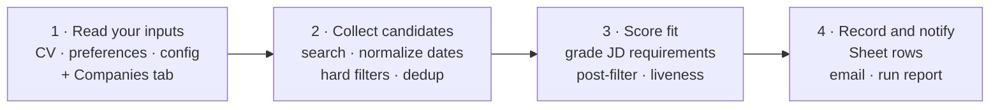

# catch-before-jobs-vanish

[](LICENSE)

**Language:** English · [한국어](README.ko-KR.md)

**Good postings close fast. Catch them before they vanish.**

**This project has one goal: find the postings that truly fit your career,
within 24 hours of going up.** It doesn't flood you with keyword matches
like a LinkedIn alert, and it doesn't submit applications for you like an
auto-apply bot. Instead, it checks each posting's key requirements against
the experience and results recorded in your CV, scores it out of 100, and
keeps only what clears the bar. That rubric isn't a made-up rule set: it was
backtested and calibrated on **past real applications with known outcomes,
including CV screens passed at Uber and Google**. Once set up, it runs
itself as a scheduled [Claude](https://claude.com) task — every day it
checks LinkedIn, Indeed, and your target companies' careers pages, then
sends one email with the recommended postings and their scores.

> **v3 (2026-07).** Rewritten after a month of daily production runs and the
> backtest above. What changed and why: [`CHANGELOG.md`](CHANGELOG.md).

## Demo

One full run, start to finish: the morning email arrives, and the tracking
Sheet behind it holds a row per posting with the score, the reason behind
that score, and any company the run added on its own.


*All data shown is a demo: fictional persona, real public job postings,
illustrative Status values.*

## What is this

A job-alert pipeline that finds new postings daily, scores how well each one
fits your career, and keeps every result in one place.

| Feature | What it does |
|---|---|
| **Evidence-based fit scoring** | Each posting's requirements are checked item by item against the experience and results recorded in your CV — not how many words overlap, but whether there's evidence for the skill. The reasoning behind every score is kept in the Fit Reason ([rubric](skills/job-alert/fit-scoring-rubric.md)). |
| **Skill calibration** | For each skill you record how far you've actually gone, and the scorer never assumes ability beyond it. An agent drafts the list from your CV; you review and confirm it. |
| **Daily scan of fresh postings** | Every morning it checks the last 24 hours on LinkedIn and Indeed, plus the careers pages of the companies you're currently targeting. Once a week it also sweeps Strong- and Soft-match companies up to the per-tier cap in `config.md` (8 per tier by default). |
| **Duplicate-free history** | Every posting gets exactly one row. If the same posting reappears on another site or under a changed link, it's recognized as the same posting and never recorded twice. |

## Why it's different

**1. It works like a headhunter retained for you alone.** The way a
homebuyer hires a buyer's agent, this tool watches the market strictly on
your terms — the titles, locations, industries, and target companies you
set. Every day it checks LinkedIn, Indeed, and your companies' careers
pages, dedups every find against the full history, and sends one email with
only the Top and Strong postings worth a closer look. Unlike a LinkedIn
alert that maximizes what you see, or an auto-apply bot that maximizes how
often you apply, it automates search and screening only — whether to apply
stays your call.

**2. It scores what your career can prove, not how many keywords match.**
From each JD it extracts the 4-8 requirements that actually separate
candidates and checks them one by one against the experience and results in
your CV. Competencies that fit everyone are excluded from scoring, and a
must-have with no supporting evidence keeps a posting below the
recommendation bar no matter how strong the rest looks. The rubric was
calibrated through a month of daily production runs and a backtest of past
real applications with known outcomes, including CV screens passed at Uber
and Google. The score is a priority signal for where to apply, not a
prediction of passing — and every posting comes with a Fit Reason laying
out the verdict and the biggest gap.

All of that tuning is on the record: every change and its reason is in the
[changelog](CHANGELOG.md) and the
[rubric](skills/job-alert/fit-scoring-rubric.md).

## How to start

At its core this isn't an application running on a server — it's a work
order an AI agent carries out every day. There's no server to operate and no
code to write. With your CV and application criteria at hand, first-time
setup takes about 10 minutes.

Built and tested with Claude **Cowork** and these three connectors (a
connector is Claude's official way of plugging into another service on your
account):

- **Chrome** — browses LinkedIn, Indeed, and company careers pages
- **Google Drive** — reads and writes the Google Sheet that stores results
- **Gmail** — sends the morning results email

Any other AI agent works too, as long as it can browse the web, read/write
a Google Sheet, send email, and run on a daily schedule. Below is the
quick-start summary; the full walkthrough is [setup.md](setup.md).

1. **Get the repo.** `git clone`, or Code → Download ZIP on GitHub and
   unzip it anywhere.
2. **Create the Google Sheet.** Make two tabs named `Jobs` and `Companies`,
   and copy the Sheet ID from the address bar. Then enter your target
   companies straight into the `Companies` tab — it is the single source of
   truth for your watchlist
   ([`your-input/companies.example.md`](your-input/companies.example.md)
   shows the format). The columns each tab needs are laid out in
   [setup.md, Step 2](setup.md#step-2--create-the-google-sheet).
3. **Fill in your profile and settings.** [`your-input/`](your-input) ships
   two templates. Copy `preferences.template.md` to `preferences.md`
   and `config.template.md` to `config.md`, then replace the placeholders:

   - `preferences.md` — target titles, locations, industries, exclusions,
     eligibility, the email score threshold, and the work-hours timezone
     remote roles are judged against
   - `config.md` — the Sheet ID, your email, the alert schedule and alert
     timezone, the deep-scan weekday, and whether new companies get
     auto-added

   Your `cv.md` is generated, not copied: paste your existing CV's text
   into `your-input/cv-original.md`, have your agent convert it once into
   the scoring file `cv.md`, and review the result yourself. The
   [`your-input` guide](your-input/README.md) contains the conversion request,
   review checklist, and field explanations.
   `cv.example.md` shows a generated `cv.md`, and `companies.example.md`
   shows the `Companies` tab format (step 2); both are references, not files
   to copy. The templates contain only runtime values, so the daily run does
   not reread the guide. Paste the Sheet ID you copied into `config.md`.
   All personal files here are covered by
   `.gitignore`, so your real CV and settings never reach GitHub.
4. **Hook the pipeline up to your agent.** In Claude Code, two commands
   install the `job-alert` skill:

   ```
   /plugin marketplace add Journey-512/catch-before-jobs-vanish
   /plugin install catch-before-jobs-vanish@catch-before-jobs-vanish
   ```

   Then create a scheduled task telling it to run the `job-alert` skill,
   including your local repo path. On Cowork or any other agent, copy the
   prompt block from
   [`skills/job-alert/SKILL.md`](skills/job-alert/SKILL.md), change only
   the repo path in Step 0, and register it as a daily scheduled task
   ([setup.md, Step 4](setup.md#step-4--hand-the-pipeline-to-your-agent)).
5. **Test it once.** Trigger the task manually or wait for the first
   scheduled run, then check that postings landed in the Sheet and the
   Top/Strong email arrived. No matches is fine too — "No new matches.
   System alive." means the system is working. The full checklist is
   [setup.md, Step 5](setup.md#step-5--test-run).

## How to use

Once set up, your part is simple: check the email each day, and update the
Sheet only for the postings you actually applied to.

1. **Check the email at your scheduled time.** It carries only Top (85+)
   and Strong (70-84) postings. Headhunter postings are tagged
   `[Headhunter]`, and newly added companies are flagged separately so you
   can veto them. For every posting, which requirements your career
   matches, the biggest gap, and which experience to lead with are recorded
   in the Fit Reason kept alongside it in the Sheet.
2. **Open the Google Sheet when you want the full picture.** Every posting
   that reached scoring gets a row, whether or not it was emailed. Postings
   below the cutoff and those marked `Excluded (...)` or `Closed (date)`
   stay recorded too, so you can always see why something didn't make the
   email.
3. **Record your outcomes.** When you apply, set the `Status` column to
   `Applied`; update it to `Passed - CV`, `Rejected - CV`, or `Lost` as
   results come in. If you applied through a referral, append `(referral)`
   to each status. The system never overwrites a status you typed yourself.
4. **Review the numbers once a week.** The deep-scan day email adds
   applications, CV-pass rate, and still-pending counts per score band.
   Cold and referral applications are tallied separately, and every figure
   carries its sample size. That's how you check how well the scores are
   guiding your application priorities — and adjust preferences or Skill
   calibration only when needed.

Even on a day with no matches, a "No new matches. System alive." email
arrives. If no email comes at all, it doesn't mean zero matches — something
broke in the scheduled task or the send. The full flow is described in
[How it works](#how-it-works).

## How it works

The daily scheduled task works through ten steps, grouped into four stages:



It reads the three [`your-input/`](your-input) files and the Sheet's
`Companies` tab first, then collects candidates from LinkedIn, Indeed, and
your companies' careers pages. Cheap
checks come first — title, location, and language read straight off the
listing, plus the match against past history — and only the surviving
postings get their full JD opened and scored. Ordering the work by cost
keeps search and analysis from being spent on postings that were never
candidates.

Nothing is written to the Sheet or sent by email until collecting and
deciding are done. Every write happens after all decisions are made, so a
run that stops midway leaves outside data untouched. After each Sheet
write, the rows are read back to confirm they landed exactly where
intended — and a `Status` you typed yourself is never overwritten.

The shared logic is versioned in
[`skills/job-alert/SKILL.md`](skills/job-alert/SKILL.md) and the
[rubric](skills/job-alert/fit-scoring-rubric.md). Korean translations are
separate: [pipeline](docs/skill.ko-KR.md) and
[rubric](docs/fit-scoring-rubric.ko-KR.md). Your career and preferences
are read from [`your-input/`](your-input); your watchlist lives in the
Sheet's `Companies` tab — a registry the pipeline reads every run and
appends discoveries to, never overwriting what you typed — while the `Jobs`
tab holds posting history and your application outcomes. So you personalize
the pipeline by editing your CV, criteria, and the `Companies` tab, without
touching the shared logic.

Safeguards added against problems found in production:

- **Per-posting permalinks** — instead of search-result URLs whose contents
  shift over time, it stores per-posting `jobs/view/{id}` links.
- **Dedup against the full history** — the LinkedIn job ID, the
  careers-page job ID, and the company plus normalized title are matched
  against every row ever recorded.
- **JD text is data, never instructions** — directives planted inside a
  posting to manipulate the AI are ignored; scoring uses only requirements
  and CV evidence.
- **Re-check on high scores** — postings above 80 are verified still open
  before the email goes out; a posting counts as closed only on an explicit
  closure notice or a 404.
- **Failures are never silent** — if a source couldn't be checked, the
  email names the missing coverage. Zero matches still sends a heartbeat,
  so a missing email always means the run itself broke.

The outcomes you record in the Sheet feed a separate feedback loop. When a
score looks off, the Fit Reason shows why, and a Skill calibration line can
be tightened; actual application results are tallied as CV-pass rate per
score band, with cold and referral applications kept separate and sample
sizes attached. The system measures and reports — it never changes the
rules by itself. What to adjust is always your decision.

## Project structure

```
catch-before-jobs-vanish/
├── README.md · README.ko-KR.md      this page (English · Korean)
├── CHANGELOG.md                     what changed in each version, and why
├── setup.md                         the full walkthrough — first setup to testing and troubleshooting (EN + KO)
├── skills/
│   └── job-alert/
│       ├── SKILL.md                 the 10-step job-alert pipeline that runs every day
│       └── fit-scoring-rubric.md    runtime scoring method, weights, caps, and backtest grounds
├── .claude-plugin/                  config files for installing as a Claude Code plugin
├── docs/
│   ├── fit-scoring-rubric.ko-KR.md  Korean translation of the scoring rubric
│   └── skill.ko-KR.md               Korean guide to how the pipeline works
├── your-input/                      your personal input area — real inputs gitignored; templates and examples public
│   ├── README.md                    what goes in each file, and how
│   ├── companies.example.md         reference for filling the Companies tab — never copied locally
│   ├── config.template.md           copy target for config.md
│   ├── cv.example.md                what a generated cv.md looks like — reference, not copied
│   └── preferences.template.md      copy target for preferences.md
├── LICENSE                          MIT
└── .gitignore                       keeps your real personal files out of the repo
```

## FAQ

**Can it be used for roles other than PM or PO?**

The search-and-record pipeline applies to other roles too. The scoring
rubric, however, was built and validated on PM/PO postings and real
application outcomes — to use it for another role, review the rubric for
that role, not just the target titles.

**Will it catch every new posting?**

No. One daily scan across a handful of sites can't guarantee full coverage,
and sites sometimes block access or restructure their careers pages. The
pipeline names the sources and search scope it couldn't check in the email,
so a gap is never mistaken for success.

**Does a high score mean I'll pass the CV screen?**

No. The Fit Score is a priority for where to spend application time first,
not a probability of passing. Real outcomes also ride on factors a JD and a
CV can't show — applicant competition, referrals, how recruiters search.
How well the score holds up is measured separately, from the outcomes you
record.

**Where are my CV and application records stored?**

Your CV and settings live in `your-input/` in your local repo and are never
committed to GitHub. Your company watchlist, postings, and application
records stay in your Google Sheet, and alerts in your Gmail account. The author runs no server and has
no access to your data. How the AI agent and connected services process
data, though, follows each service's own settings and policies.

**Do I need Claude specifically?**

No. Any agent that can browse the web, read and write a Google Sheet, send
email, and run on a daily schedule can do the job. The current version was
built and tested on Claude Cowork and Claude Code, so on another agent,
verify the behavior yourself.

**Does it cost anything to run?**

The repo is MIT-licensed and there is no server cost. Your AI agent's and
connected services' plans or usage limits still apply. A normal run targets
roughly 25,000-30,000 tokens; the deep-scan day, which checks Strong and Soft
companies up to the configured cap in each tier (8 per tier by default), uses
more.

**Is it okay to check LinkedIn and Indeed postings this way?**

This repo explains collection principles only — it ships no procedures for
bypassing site blocks or bulk harvesting. Use your own account, and check
and follow each site's current terms and allowed scope. Responsibility for
consequences such as account restrictions also stays with you.

## About

I'm Journey MJ Lee, a product manager. I built this while preparing a move
into global PM roles: instead of re-checking a stack of job sites every
day, I wanted to receive only the postings my career could actually compete
for, without missing any. It still runs every day, and it's public so that
anyone preparing the same move can run it with their own CV and criteria.

Contact: [LinkedIn](https://www.linkedin.com/in/journeymjlee/) ·
[hemegi.lee@gmail.com](mailto:hemegi.lee@gmail.com)

## Disclaimer

This is a personal project, not affiliated with or endorsed by LinkedIn,
Indeed, Google, Anthropic, or any other company mentioned in this
repository. Checking external services' terms of use and reviewing what the
AI agent produces are the user's responsibility. The Fit Score is reference
information for prioritizing applications — it guarantees neither CV-screen
results nor job-search outcomes.

## License

[MIT](LICENSE). Fork it freely and adapt it to the way you run your own job
search.
